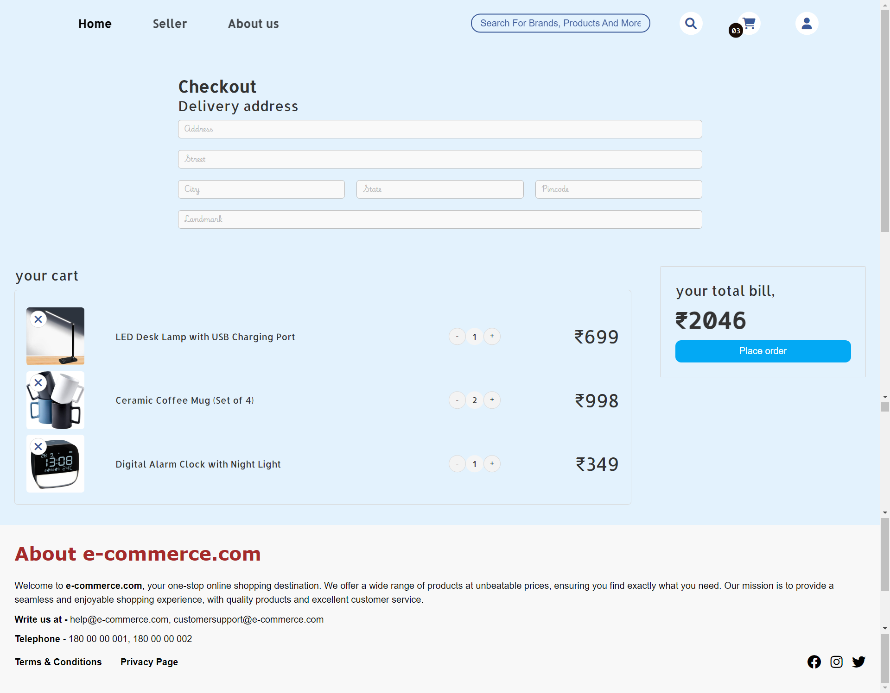

# About Project

This project, a basic online e-commerce website was developed as part of my CDAC coursework. It features a user-friendly design to ensure ease of use, with a simple and intuitive interface.

## Technologies Used

- Front-end: HTML, CSS, JavaScript
- Back-end: Node.js
- Database: Google Firebase (NoSQL)
- Payment Gateway: Stripe (demo)

## Dependencies

- aws
- aws-sdk
- bcrypt
- dotenv
- express.js
- firebase
- nodemon
- stripe

## Please Note

1. The project does not focus on making the site fully responsive.
2. The project is not intended for real-life use.
3. Please do not enter sensitive information, such as credit card details, CVV, personal details, etc.

## Installation

1. Clone the repository and navigate to the project directory.
2. Install required dependenices.
3. Start the development server: `nodemon server.js`.
4. Access the application locally at `http://localhost:3000/index.html`.

## Usage

1. **Signup and Login:**
   - Sign up using your name, email id, mobile number, and password. Use these credentials to log in.
2. **Seller Registration:**
   - If you are a seller, register with basic details about your business.
3. **Seller Dashboard:**
   - Add, edit, and delete products through the seller dashboard.
4. **Customer Actions:**
   - Search products, add and edit reviews, add and remove products to the cart, and proceed to checkout.

## About Me

You can learn more about me and explore my other projects on my [personal portfolio website](https://siddheshmestri.online).

## Screenshots

### Error Pages

- **404 Error Page**

  This screenshot shows the custom error page displayed when a user navigates to a non-existent URL.
  

### Authentication Pages

- **Login Page**

  Here's the login page where users can authenticate themselves to access their accounts using email id and password.
  

- **Signup Page**

  This screenshot displays the signup page where new users can create an account using name, email id, contact number and password.
  

### Home Page

- **Home Page (No User Logged In)**

  The main landing page of the application when no user is logged in, showcasing featured products and categories.
  

- **Home Page - Header**

  This section highlights the navigation header of the home page, providing easy access to different sections of the application.
  

- **Home Page - Best Selling Categories**

  Displays the best selling categories section on the home page, showcasing popular product categories.
  

- **Home Page - Product Image Collage**

  A collage of product images on the home page, illustrating a visually appealing display of featured products.
  

- **Home Page - End Section**

  The end section of the home page, highlighting additional information or call-to-action elements.
  

- **Home Page - Review Section**

  This section showcases customer reviews on the home page, providing customer feedbacks.
  

### Seller Pages

- **Seller Page**

  View of the seller page where users can register themselves as sellers by providing basic business details.
  

- **Seller Dashboard**

  Dashboard interface for sellers to product information.
  

### Product Management Pages

- **Add New Product Page**

  Form page for sellers to add new products to the catalog.
  

- **Edit Product Page**

  Page allowing sellers to edit existing product details.
  

### Search Pages

- **Search Results**

  Display of search results based on user queries.
  

- **Empty Search Results**

  Visual representation of the search results page when no matches are found.
  

### Product Pages

- **Product Page - Product Details Section**

  Detailed view of a product, including product details, pricing, and reviews.
  

- **Product Page - Review Section**

  Customer reviews section on a product page, providing insights and feedback.
  

- **Product Page - Similar Products Section**

  Section displaying related or similar products to encourage exploration and comparison.
  

### Cart and Checkout Pages

- **Empty Cart**

  View of the shopping cart when it's empty, prompting users to add items.
  

- **Cart**

  The shopping cart with items added, displaying order details and options for checkout.
  

- **Checkout**

  Checkout page where users finalize their purchases and enter payment information.
  

### Payment Pages

- **Payment Gateway**

  Interface showing the payment gateway used for secure transactions, powered by Stripe.
  
